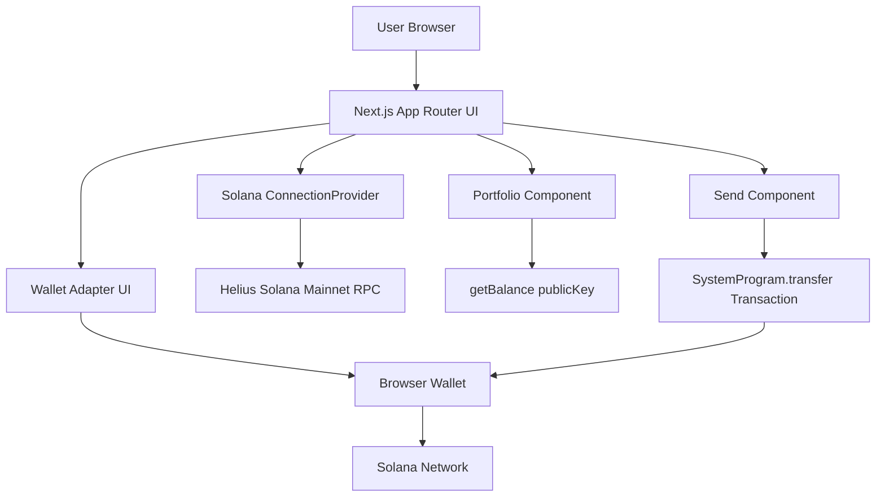

# Solana Wallet DApp


A modern Solana wallet interface built with Next.js, React, TypeScript, Tailwind CSS, and Solana Wallet Adapter. The app connects to a Solana wallet, displays the connected public address, fetches the wallet SOL balance, and prepares native SOL transfer transactions through the connected wallet.

## Preview

Replace `public/screenshot.png` with your final project screenshot before publishing the repository or attaching it to your resume.


## Features

- Wallet connect and disconnect flow using Solana Wallet Adapter UI.
- Solana RPC connection through `ConnectionProvider`.
- Public key display for the connected wallet.
- SOL balance lookup using `connection.getBalance`.
- Native SOL transfer transaction creation with `SystemProgram.transfer`.
- Client-side signing flow through the connected wallet.
- TypeScript-first Next.js App Router project structure.
- Tailwind CSS 4 setup for styling.

## Tech Stack

| Area | Technology |
| --- | --- |
| Framework | Next.js 16 |
| UI Library | React 19 |
| Language | TypeScript |
| Styling | Tailwind CSS 4 |
| Blockchain | Solana |
| Wallet Layer | `@solana/wallet-adapter-react`, `@solana/wallet-adapter-react-ui` |
| Transaction SDK | `@solana/web3.js` |
| Linting | ESLint 9 with Next.js Core Web Vitals config |
| Package Manager | npm |

## Architecture



## Application Flow

1. The app initializes a Solana RPC endpoint inside `ConnectionProvider`.
2. `WalletProvider` exposes wallet state and transaction helpers to child components.
3. `Topbar` renders either the connect button or disconnect button based on wallet state.
4. `Portfolio` reads the connected public key and fetches the wallet balance.
5. `Send` builds a native SOL transfer transaction and sends it through the connected wallet.

## Project Structure

```text
dapp/
├── app/
│   ├── globals.css       # Tailwind CSS entrypoint
│   ├── layout.tsx        # Root layout and font setup
│   └── page.tsx          # Wallet providers, portfolio, and send flow
├── public/
│   ├── screenshot.png    # README preview image
│   └── *.svg             # Static assets
├── eslint.config.mjs     # ESLint configuration
├── next.config.ts        # Next.js configuration
├── package.json          # Scripts and dependencies
├── tsconfig.json         # TypeScript configuration
└── README.md
```

## Getting Started

### Prerequisites

- Node.js 18.18 or later
- npm
- A Solana browser wallet such as Phantom, Solflare, Backpack, or another wallet supported by the wallet adapter ecosystem

### Installation

```bash
npm install
```

### Development

```bash
npm run dev
```

Open the local URL printed by Next.js, usually:

```text
http://localhost:3000
```

### Production Build

```bash
npm run build
npm run start
```

### Linting

```bash
npm run lint
```

## Configuration

The current RPC endpoint is configured in `app/page.tsx`:

```ts
const endpoint = "https://mainnet.helius-rpc.com/?api-key=...";
```

For production, move the RPC URL to an environment variable:

```env
NEXT_PUBLIC_SOLANA_RPC_URL="https://your-rpc-endpoint"
```

Then read it in the app:

```ts
const endpoint = process.env.NEXT_PUBLIC_SOLANA_RPC_URL!;
```

## Security Notes

- Never commit private keys, seed phrases, or wallet files.
- Use wallet-based signing only. The app should never request custody of user funds.
- Keep RPC API keys out of source code for production deployments.
- Prefer devnet while testing transfers.
- Review transaction details before signing in the wallet.
- Current transfer input is passed directly into `lamports`; convert SOL to lamports before using this in a production payment flow.

## Scripts

| Command | Description |
| --- | --- |
| `npm run dev` | Start the local development server |
| `npm run build` | Create an optimized production build |
| `npm run start` | Run the production server |
| `npm run lint` | Run ESLint checks |

## Roadmap

- Add environment-based RPC configuration.
- Add devnet/mainnet network selector.
- Convert user-entered SOL values to lamports safely.
- Add transaction confirmation status and explorer link.
- Add form validation for wallet addresses and amounts.
- Add toast notifications for success and error states.
- Add unit tests for wallet-dependent UI states.
- Improve layout and responsive styling for production use.

## Contributing

Contributions are welcome. Please follow this workflow:

1. Fork the repository.
2. Create a feature branch:

```bash
git checkout -b feature/your-feature-name
```

3. Install dependencies and run the app locally:

```bash
npm install
npm run dev
```

4. Run quality checks before opening a pull request:

```bash
npm run lint
npm run build
```

5. Open a pull request with a clear description, screenshots for UI changes, and notes about any Solana transaction behavior.

## Resume Highlights

- Built a Solana wallet-enabled decentralized application using Next.js and TypeScript.
- Integrated Solana Wallet Adapter for wallet connection, account state, and transaction signing.
- Implemented balance fetching and native SOL transaction creation using Solana RPC and `@solana/web3.js`.
- Structured the project with production-ready documentation, linting, and build scripts.

## License

This project is currently private. Add a license such as MIT before publishing it as an open-source repository.
